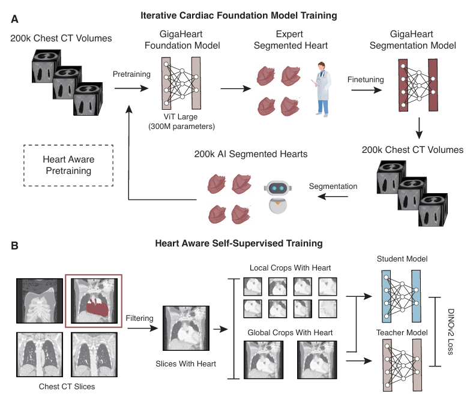

# GigaHeart
## A Cardiac-specific CT Foundation Model for Heart Transplantation

[[`Huggingface Model`](https://huggingface.co/gigaheart/gigaheart)]

Hanwen Xu, Addie Woicik, Sanaz Asadian, Junbo Shen, Zhengyan Zhang, Ali Nabipoor, J. Peter Musi, Jeffrey Keenan, Maziar Khorsandi, Bassel Al-Alao, Ioannis Dimarakis, Hamid Chalian, Yiing Lin, Daniel Fishbein, Jay Pal*, Sheng Wang*, Shin Lin* (*Corresponding authors)

## Model Overview

<p align="center">
     <br>

  *Overview of heart-aware training in GigaHeart*

</p>

## Install

On an NVIDIA A100 Tensor Core GPU machine, with CUDA toolkit enabled.

1. Download our code and open the GigaHeart

```Shell
git clone https://github.com/gigaheart/gigaheart
cd gigaheart
```

2. Install GigaHeart and its dependencies

```Shell
conda env create -f environment.yaml
conda activate gigaheart
```

## Model Download

The GigaHeart models can be accessed from [Huggingface](https://huggingface.co/gigaheart/gigaheart).

## Inference

The GigaHeart model consists of a data preprocessing module and a vision transformer module. We released the pretrained model here with the relevant codes to get output embeddings. We will release more code relevant to evaluation and heart size matching upon publication.

### Inference with the GigaHeart model

Takes a .tif file as input, applies min–max normalization (scaling values to 0–1), and performs volume-level histogram equalization. Download the example input data from [Example](https://drive.google.com/file/d/1GuUr20w6dRoqHr2zs79RAKU_-8OTLpRi/view?usp=sharing) and put it under the example folder.

```Python
from utils import process_ct

images, _, _ = process_ct("example/CTseg_1_raw.tif")
```

Then load the GigaHeart encoder:
```Python
import timm
from PIL import Image
from torchvision import transforms
import torch
from torch import nn
from timm.layers import Mlp

gigaheart = timm.create_model("hf_hub:gigaheart/gigaheart", act_layer=nn.GELU, mlp_layer=Mlp, pretrained=True)

class MaybeToTensor(transforms.ToTensor):
    """
    Convert a ``PIL Image`` or ``numpy.ndarray`` to tensor, or keep as is if already a tensor.
    """

    def __call__(self, pic):
        if isinstance(pic, torch.Tensor):
            return pic
        return super().__call__(pic)
    
transform = transforms.Compose(
    [
        transforms.Resize(256, interpolation=transforms.InterpolationMode.BICUBIC),
        transforms.CenterCrop(224),
        MaybeToTensor(),
        transforms.Normalize(mean=(0.485, 0.456, 0.406), std=(0.229, 0.224, 0.225)),
    ]
)
```

Running inference to extract CT embeddings:
```Python
  images_torch = transform(images)

  with torch.no_grad():
      output = gigaheart(images_torch)
      print("Model output:", output.shape)
```

## Model Uses

### Intended Use
The data, code, and model checkpoints are intended to be used solely for (I) future research on chest CT foundation models/heart size matching and (II) reproducibility of the experimental results reported in the reference paper. The data, code, and model checkpoints are not intended to be used in clinical care or for any clinical decision-making purposes.

### Primary Intended Use
The primary intended use is to support AI researchers reproducing and building on top of this work.

### Out-of-Scope Use
**Any** deployed use case of the model --- commercial or otherwise --- is out of scope. Although we evaluated the models using a broad set of publicly-available research benchmarks, the models and evaluations are intended *for research use only* and not intended for deployed use cases.

## Usage and License Notices

The model is not intended or made available for clinical use as a medical device, clinical support, diagnostic tool, or other technology intended to be used in the diagnosis, cure, mitigation, treatment, or prevention of disease or other conditions. The model is not designed or intended to be a substitute for professional medical advice, diagnosis, treatment, or judgment and should not be used as such.  All users are responsible for reviewing the output of the developed model to determine whether the model meets the user’s needs and for validating and evaluating the model before any clinical use.

## Acknowledgements

We would like to express our gratitude to the authors and developers of the exceptional repositories that this project is built upon: DINOv2, MAE, Timm, and TorchScale. Their contributions have been invaluable to our work.
